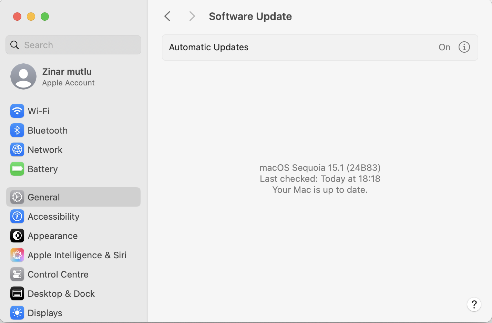

&nbsp;
# INTRODUCTION AND TASK 1
## OPERATING SYSTEMS AND SECURITY (OSSEC)
- **Student Name:** Zinar Mutlu
- **Student ID:** 0629829
- **Email:** zinar.mutlu@vub.be
- **Date:** 19/11/2024
&nbsp;

## 1. Introduction 
Operating systems and security focus on keeping data safe by implementing rules, ensuring OS availability, using access controls, passwords, and encryption to maintain the confidentiality and integrity of data. A system security policy administrator establishes key rules to safeguard the operating system. OS security involves protecting the system from threats such as viruses, malware, and hackers. It also includes measures to prevent theft, alteration, or loss of critical system information.
&nbsp;
---
## 2. Task 1
I analyzed my device's hardware, software, and potential security vulnerabilities. Specifically, I evaluated the specifications of my MacBook Pro along with its connected devices, including removable hardware, network equipment, and software configurations.  

As part of the process, I tested the system's antivirus capabilities using the EICAR test file and AMTSO checks. I optimized the device's performance by using disk utilities to remove unnecessary large files and caches and disabling some startup apps, which significantly improved the system's boot speed.  

This task increased my awareness of system security. For instance, I discovered that the firewall was not enabled and promptly activated it to block unwanted network traffic. My device's protection is further enhanced by tools like Malwarebytes, CleanMyMac X, and macOS's built-in security features, such as XProtect and Gatekeeper. By securing these configurations, I improved the system's reliability.  

Additionally, I ensured the operating system is always up to date, maintaining the latest security patches and performance enhancements.
&nbsp;
---
### 2.1 Exploring Personal Infrastructure
In this task, I will introduce my device(macOS 13-inch) specifications. I will also examine the characteristics of my personal computer such as O.S., processor, memory, storage, etc. 
&nbsp;

#### Device specifications
1. Operating System: macOS Sequoia (v15.1)
2. Processor: Apple M1 (ARM-based SoC)
3. Total Number of Cores:	8 (4 performance and 4 efficiency)
4. Memory(RAM): 16 GB Unified Memory 
5. Storage capacity: 494,38 GB, APPLE SSD AP0512Q, 512 GB
6. Graphics: Apple M1 GPU, 8 cores, Retina Display (13.3-inch, 2560 x 1600 resolution)

#### Removable Hardware
1. Wi-Fi Card: Wi-Fi 6  
2. Bluetooth: Bluetooth 5.0
3. Ports:
    - Two Thunderbolt 3 (USB 4) ports
    - 3.5 mm headphone jack

####  Network Equipment
1. Supported Wi-Fi standards: phy modes 802.11 a/b/g/n/ac/ax
2. Security protocols used WPA2/WPA3 Enterprise
3. Network speed: 400 Mbps

---

### 2.2 Securing My Computer
In this task, I will analyze the security of my computer by evaluating the effectiveness of the firewall, antivirus applications, and other security features that are used to protect  my computer.

#### 2.2.1. O.S. updates
O.S. updates contain new software that helps device up-to-date and protected against potential risks. These updates may include service packs, version upgrades, security patches, driver updates, and other enhancements. Regularly updating macOS ensures the latest security patches and performance improvements. Updates are automated via System Settings > General > Software Update.

&nbsp;

#### 2.2.2. Firewall
A firewall decides which network traffic is allowed to pass through and which traffic is deemed dangerous. Essentially, it works by filtering out the good from the bad, or the trusted from the untrusted. Firewalls are intended to secure private networks and the endpoint devices within them, known as network hosts. Network hosts are devices that ‘talk’ with other hosts on the network. They send and receive between internal networks, as well as outbound and inbound between external networks. As it shown in the below picture the firewall is turned on and set up to prevent unauthorised applications, programs and services from accepting incoming connections. The macOS firewall is enabled to block unauthorized connections. Verified through System Settings > Network > Firewall.

&nbsp;

#### 2.2.3. Antivirus
Apple operates a threat intelligence process to quickly identify and block malware, with defenses structured into three layers:
- **Prevent launch or execution of malware:** Tools like the App Store, Gatekeeper, and Notarization ensure that only trusted and verified software can be installed and executed.
    
&nbsp;
- **Block malware from running:** Gatekeeper, Notarization, and XProtect work together to prevent malicious software from operating on customer systems.
- **Remediate malware that has executed:**  XProtect actively scans for and mitigates threats if malware manages to execute.
    
In addition to macOS’s built-in tools, I use third-party software like Malwarebytes and CleanMyMac X to enhance protection against potential security threats.

To test my system's security, I used the EICAR test file. However, macOS's built-in security features did not flag the file as malicious, as these tools are designed to recognize that the EICAR file is not an actual threat and therefore allow its download.

To ensure optimal protection, I verified that XProtect was enabled and functioning. The logs confirmed that XProtect is actively performing scans and monitoring device activity as part of macOS's malware protection system. Key findings from the logs include:
        - **No Critical Errors:** The absence of warnings or error messages indicates that XProtect is operating as intended.
        - **Device Activity Monitoring:** The logs suggest that XProtect is analyzing system events and user activity to identify potential threats.

&nbsp;
#### 2.2.4. Evaluate your security: EICAR test file, AMTSO Security Features Check
The [EICAR test](pictures/eicar.txt) file was developed by the European Institute for Computer Antivirus Research (EICAR) and Computer Antivirus Research Organization (CARO) to test the response of computer antivirus programs. Instead of using real malware, which could cause real damage, this test file allows people to test anti-virus software without having to use a real malware sample. So, this file is **NOT** actually malicious, but by industry-wide agreement this file is detected as malicious by mainstream products with antivirus functionality so that people can verify that their anti-malware product’s detection capability is configured correctly. 

- EICAR Test File: Initially not detected; reconfigured XProtect and tested again. It shows my device detection capability is configured correctly.
- AMTSO Security Features Check: Verified active protection features such as download scanning and phishing protection.

---
### 2.3 Performance and Maintenance
In this section, I will optimize my MacBook's performance and enhance data security by managing startup applications, cleaning up the system, and implementing regular backups and disk maintenance. 
#### 2.3.1. Arrange Startup applications
I disabled unnecessary startup applications, which helped maintain my computer's performance. This optimization improved boot times and reduced resource usage during and after startup.

#### 2.3.2. System cleanup the update files and disk cleaning
I improved system performance and increased available storage by cleaning up the storage. I freed up disk space and enhanced overall system responsiveness by removing unnecessary files. 

- I use CleanMyMac X to clear caches and old system logs.

- Deleting large files by using filter files by size

#### 2.3.3. System repair disk and Backup
I use third-party services like Google Drive and Dropbox to back up important documents and settings. Additionally, macOS's Time Machine feature provides backup support, creating local snapshots of the system to ensure data protection and recovery. But I am not using this feature.

- I repair permissions and detect errors from  Disk Utility > First Aid.

---

## 3. Conclusion
This task provided valuable insights into my device's capabilities and current vulnerabilities. I gained awareness of tools like XProtect, which allows me to monitor security and review logs effectively.  

Through this exercise, I learned to analyze my device's hardware and network characteristics. I also became proficient in using essential security features such as the Firewall, XProtect, and Console, and explored methods for efficiently removing unwanted files from my disk. Additionally, I experienced using macOS features like Time Machine, Disk Utility, and Console for system maintenance.  

By configuring and maintaining my system efficiently, I ensured better performance and security. Completing this exercise took approximately 12 hours, including research and testing various security features.  

One challenge I faced was using the EICAR test file. Initially, it was not detected by my system’s built-in security features, leading me to believe these features were not functioning. However, I later learned that macOS security tools are designed to recognize the EICAR file as non-malicious, which clarified the confusion and prompted me to add additional security measures.  

The lack of detailed documentation on macOS security logs also delayed my evaluation. This was due to my unfamiliarity with how macOS handles certain test files, such as the EICAR file, which are intentionally allowed under specific conditions.

The task 1 is enough to understand the system and familiar with device's features.
---

## 4. References
- [Apple Support: macOS Security Features](https://support.apple.com/en-gb/guide/security/sec469d47bd8/web)
- [AMTSO Security Features Check](https://www.amtso.org/feature-settings-check-download-of-malware/)
- [Firewall](https://www.kaspersky.com/resource-center/definitions/firewall)
