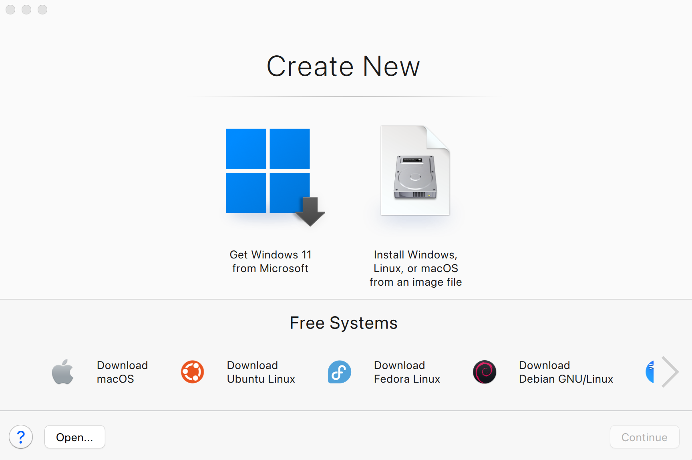
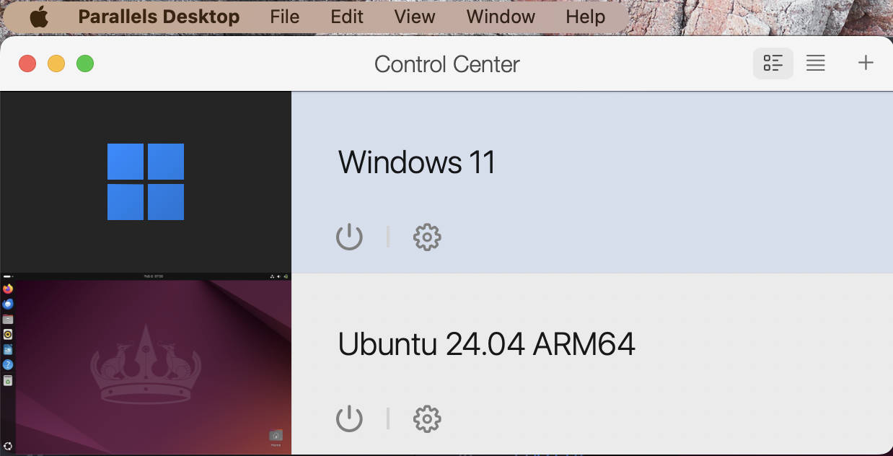
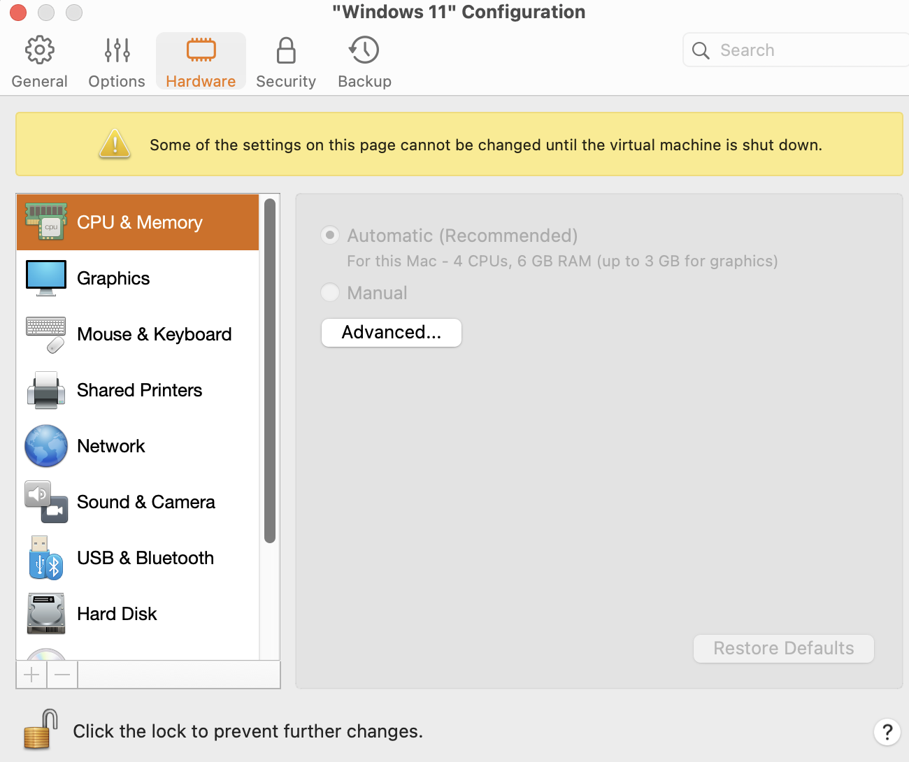
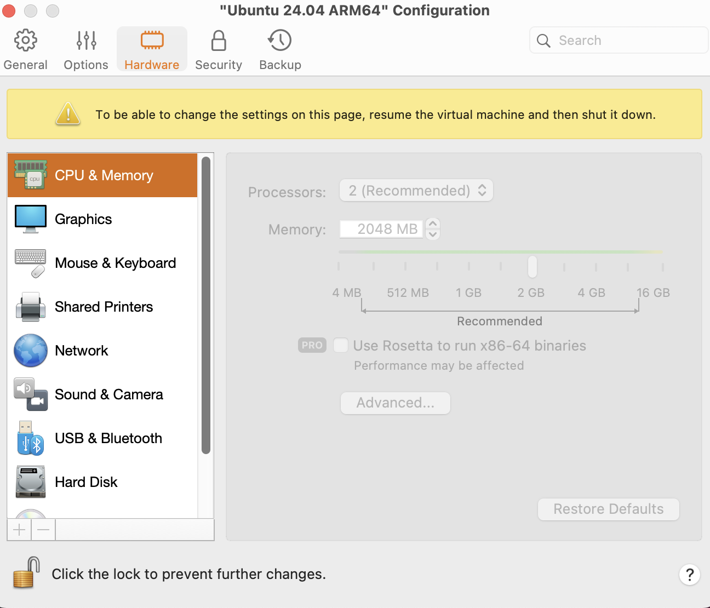
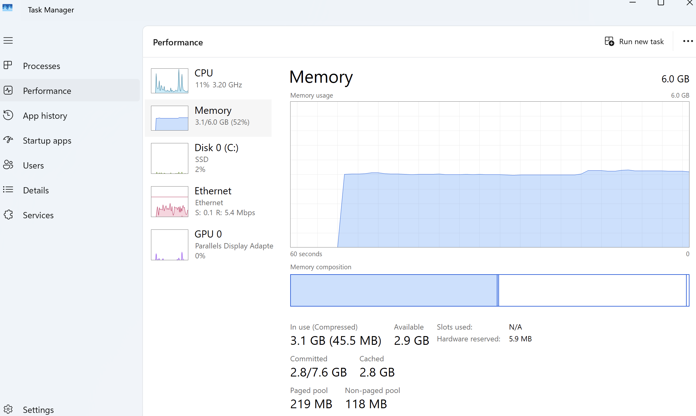
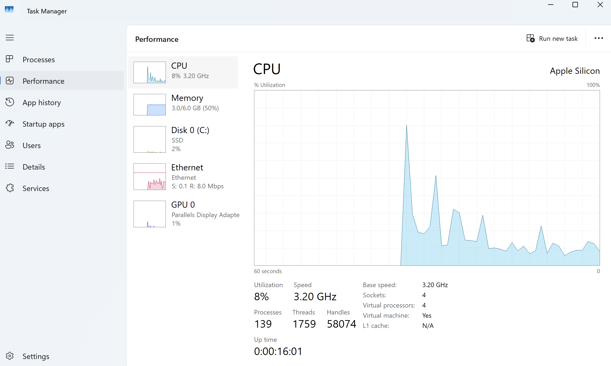
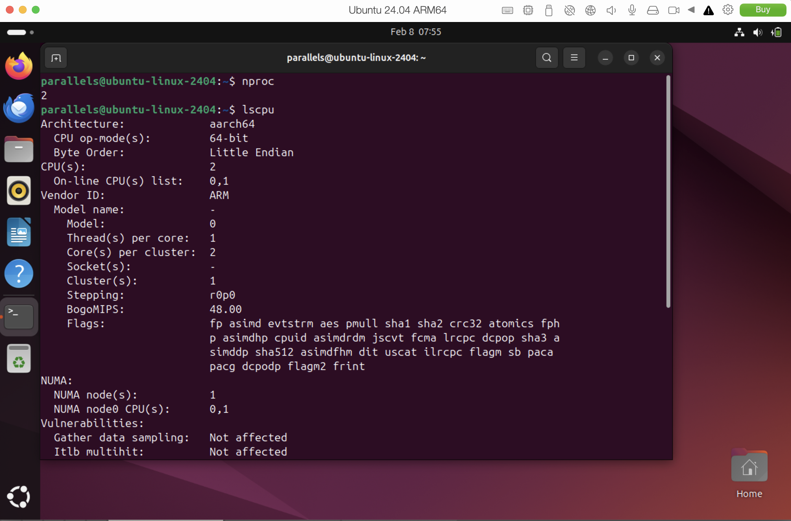
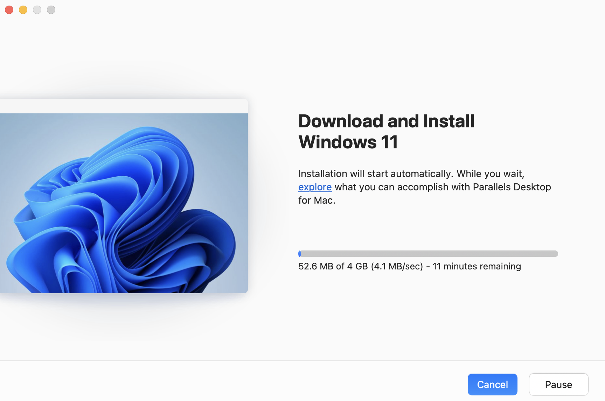
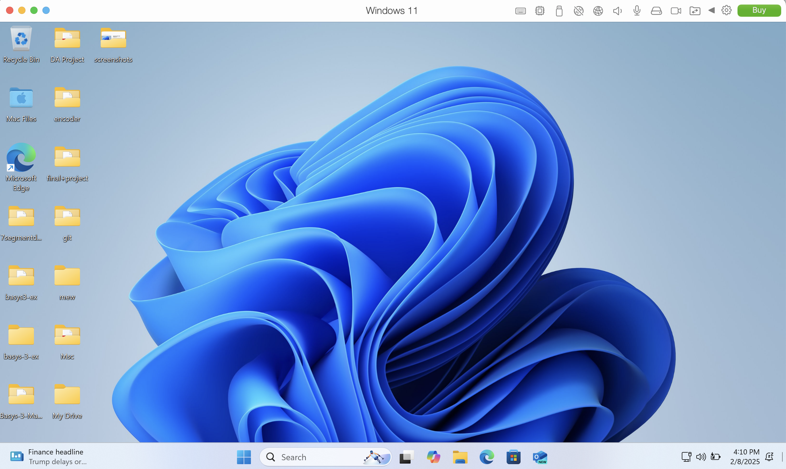
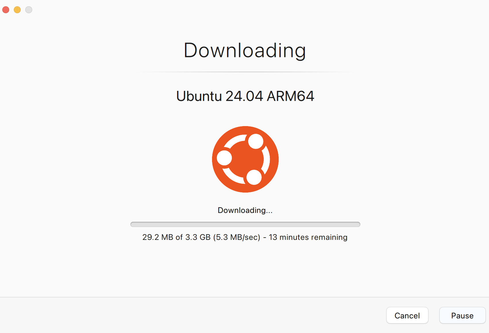

&nbsp;  
# TASK 3: VIRTUALIZATION
## OPERATING SYSTEMS AND SECURITY (OSSEC)  

- **Student Name:** Zinar Mutlu  
- **Student ID:** 0629829  
- **Email:** zinar.mutlu@vub.be  
- **Date:** 08/02/2025  

&nbsp;  

## Introduction  
Virtualization allows users to run multiple O.S on a single host machine. This capability is particularly useful to use software across different environments without requiring multiple physical devices. This report examines the process of setting up virtualization on macOS, utilizing Parallels Desktop, and deploying Windows 10 and Ubuntu LTS virtual machines (VMs). It also investigates the impact of RAM allocation and CPU core distribution on virtual machine performance.

## 1. Install VM tool (Parallels Desktop)
Since macOS does not natively support Microsoft Hyper-V or KVM, the most suitable virtualization tools for macOS include:

- Parallels Desktop
- VirtualBox

For this task, Parallels Desktop is used due to its optimized performance for macOS and integration with Apple Silicon and Intel-based Mac devices.

Installed Parallels Desktop via the below link:
https://www.parallels.com/products/desktop/welcome/

## 2. Create 2 VMs
- **Windows VM:** Used for compatibility with Microsoft applications.
- **Ubuntu VM:** Ideal for Linux-based development and server applications.

### 2.1. Motivation of RAM
The allocation of RAM in a VM is critical to ensure that the virtualized environments operate efficiently, preventing resource contention and maintaining optimal performance for both the VM and the host system.

**RAM Allocation:**
- Windows: The allocated RAM for the VM is displayed at the top right corner as 6 GB. This means the VM is configured to use 6 GB of RAM out of the total available on the Mac.

- Ubuntu: The ram is 2 GB.

### 2.2. Motivation of number of cores
The number of CPU cores allocated to a VM affects its computational capabilities and overall performance. Allocating 2 cores per VM is generally sufficient, but increasing cores may enhance performance based on workload.

- **Windows:** the number of cores is represented by the label "Sockets" and the value of "Virtual processors". VM is configured with 4 virtual processors, which likely means 4 cores allocated.

-**Ubuntu:** the number of cores is 2. 

## 3. Install Windows in one of the VMs

## 4. Install Ubuntu in the other VM

## Conclusion
Virtualization on macOS using Parallels Desktop enables seamless multi-OS deployment. By strategically allocating RAM and CPU cores, users can achieve optimal performance for both Windows and Linux environments. 
## References
- Apple Inc. "macOS Virtualization Overview." Apple Developer Documentation.
- Parallels Desktop Official Website. https://www.parallels.com/
- Microsoft. "Windows 10 System Requirements." Microsoft Documentation.
- Ubuntu. "Ubuntu LTS Installation Guide." Ubuntu Documentation.