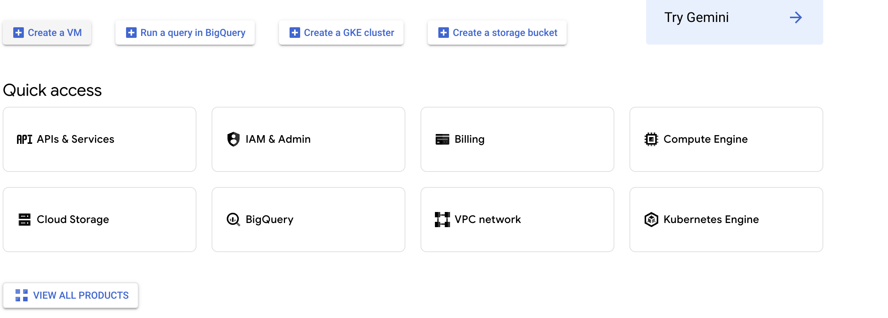
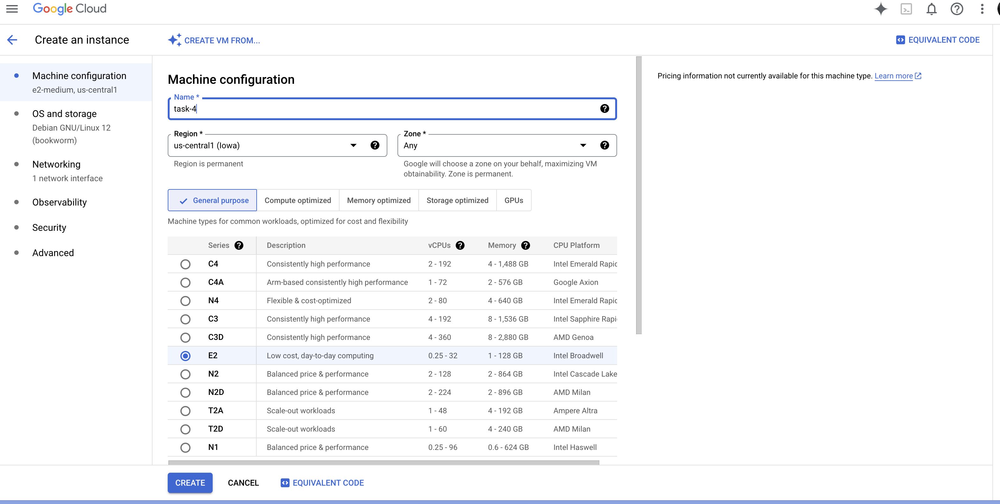
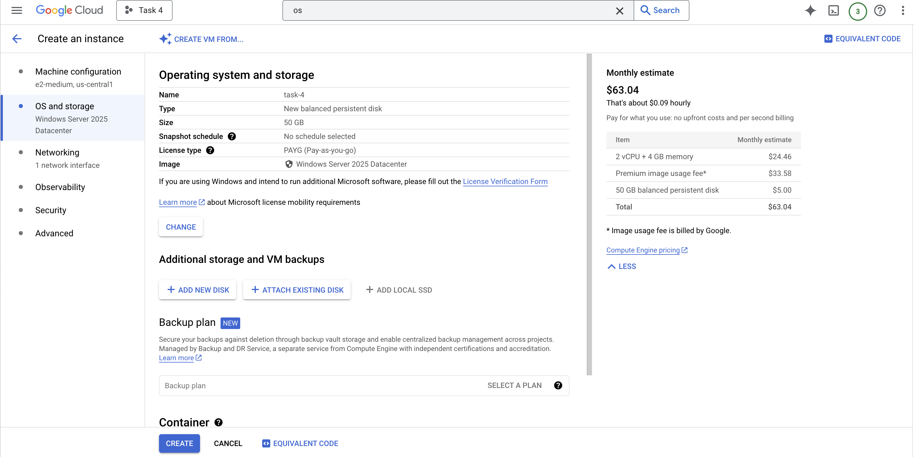
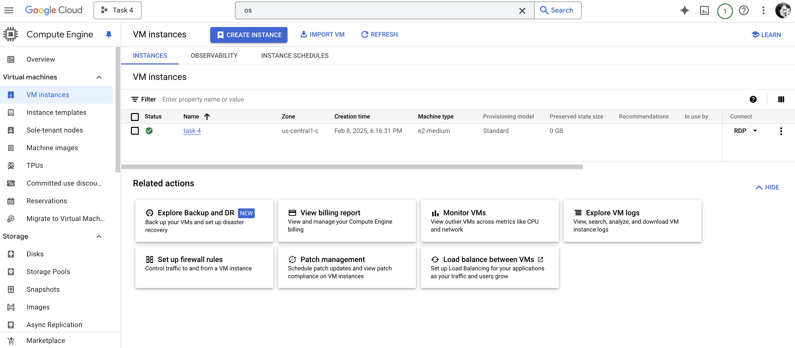
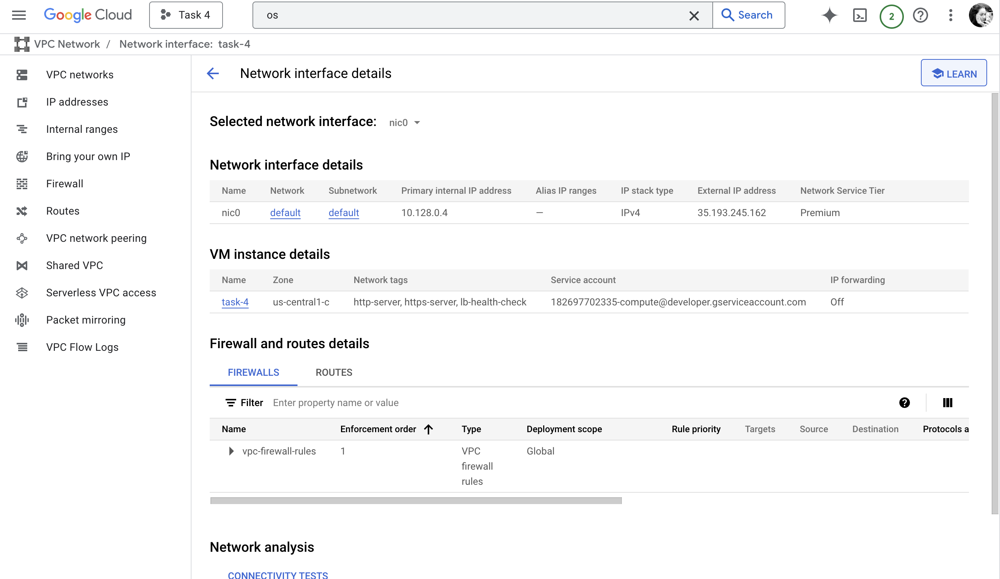
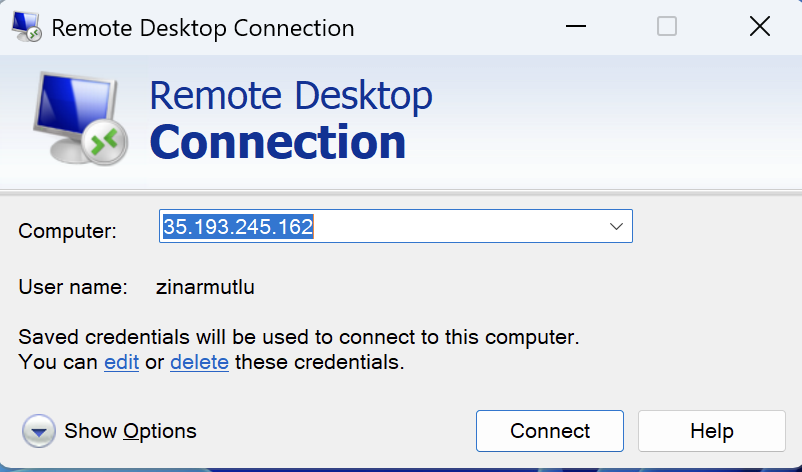
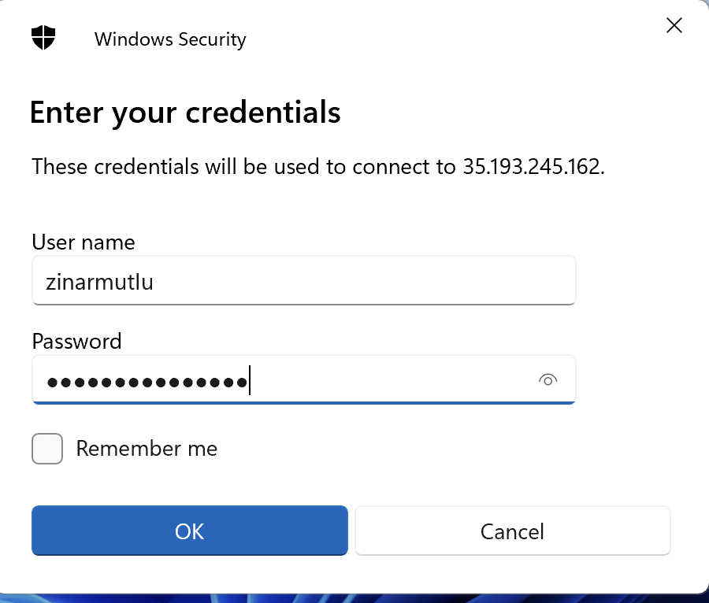
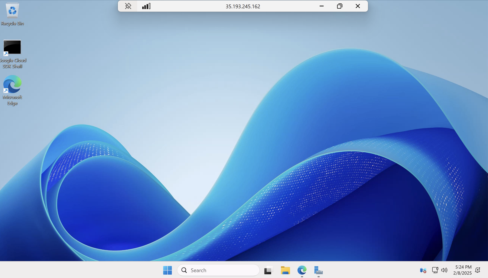
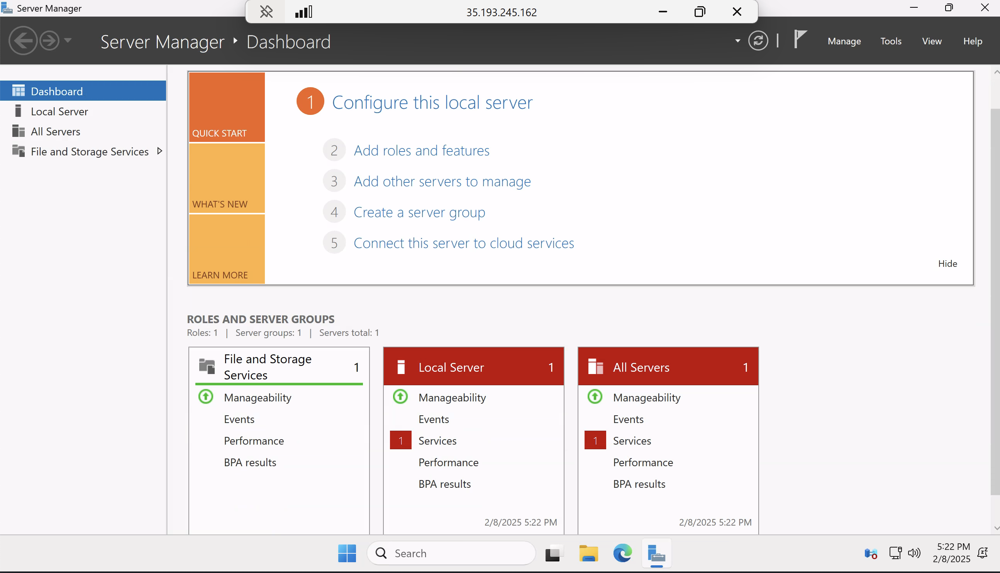
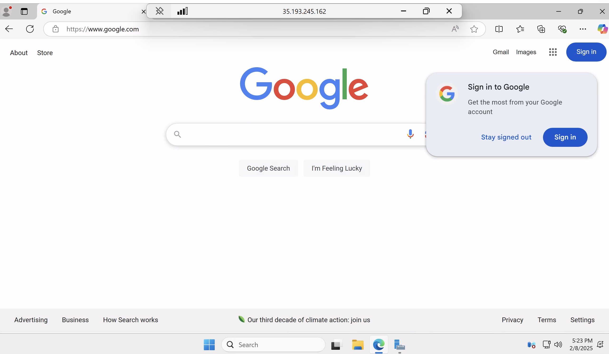

&nbsp;  
# TASK 4: CLOUD SERVICES
## OPERATING SYSTEMS AND SECURITY (OSSEC)  

- **Student Name:** Zinar Mutlu  
- **Student ID:** 0629829  
- **Email:** zinar.mutlu@vub.be  
- **Date:** 08/02/2025  

&nbsp;  

## Introduction 
Cloud services deploy and manage infrastructure. VM play an important role in cloud services, offering scalable and cost-effective solutions for many applications. In this task, i will set up a VM using a cloud service provider.

## 1. Choose a cloud service provider that offers some student discount
I chose Google Cloud service which is free for students. The steps involved include selecting a provider, configuring the VM, and installing an operating system. 

## 2. Configure your VM and install there an OS
I set up a VM on google cloud platform and then connected to the VM via Remote Desktop Control.
- Creating instance:

- Selecting O.S instance which is Windows 

- VM Windows is created whcih is named Task-4

- To connect to the VM Windows remotely, view network details and then click RDP, create an username and password.

- Open Remote Desktop Control on Windows and enter Google Cloud VM IP address: 35.193.245.162

- Enter Username and password:

- Connected to the server:

- Server Manager

- Testing browser on VM:

## Conclusion:
At the end, i created a virtual machine on google cloud by selecting Windows as operating system and then i connected to the VM to check whether is is running on the machine. It's succesfully tested on Windows. 